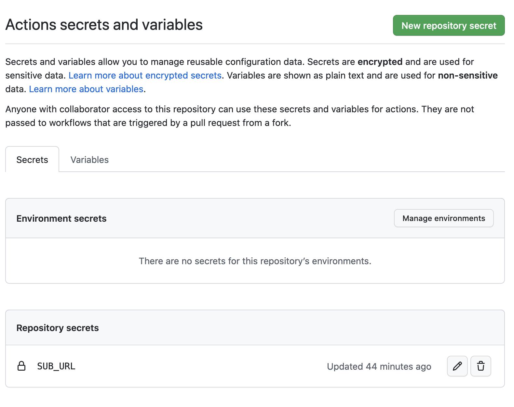
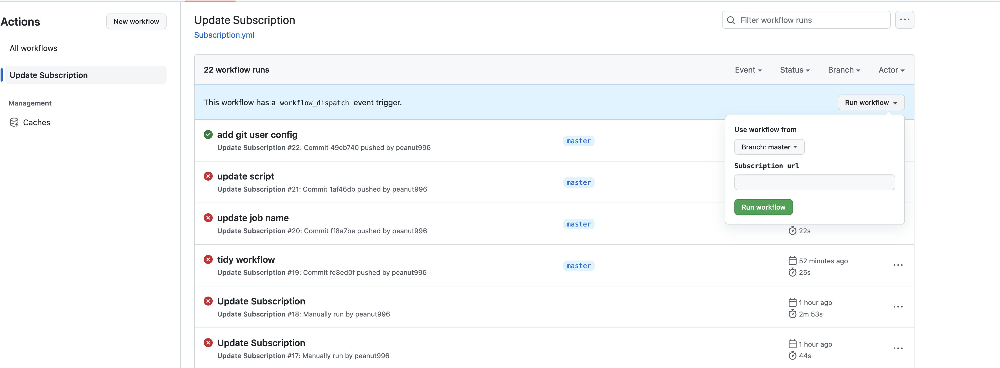

# ClashOnOpenWrt

在ROM不足的 OpenWrt 路由器上运行 Clash，支持使用Github Actions自动更新订阅。

## 说明
会把订阅信息暴露在public的repository中，请酌情判断。

## 安装

首先你需要fork本项目，然后在你的 repository 中设置你的 secrets，添加`SUB_URL`, 请确保你的clash订阅可用。




然后手动修改`install.sh`中的`download_url`为你的用户名。 就像下面这样：
  
```bash
download_url="https://raw.githubusercontent.com/<your_user_name>/ClashOnOpenWrt/master/clash.tar.gz"
```

记得Push改动到你的仓库。


## 运行

在你的 OpenWrt 路由器上运行以下命令
```bash
curl -kfsSL https://raw.githubusercontent.com/<your_user_name>/ClashOnOpenWrt/master/install.sh | sh
```

当你看到`[clash] clash start success`时，说明安装成功。

## 更新

打开仓库的 Actions 页面，点击`Update Subscription`，然后点击`Run workflow`, 输入新的订阅链接即可。你也可以直接修改仓库secret的`SUB_URL`。



## 代理

如果在大陆地区遇到Github的访问速度慢的问题，可以使用ghproxy加速。


```bash
curl -kfsSL https://ghproxy.com/https://raw.githubusercontent.com/<your_user_name>/ClashOnOpenWrt/master/install_clash.sh | sh
```

同时你的`install.sh`中的`download_url`也需要修改为

```bash
download_url="https://ghproxy.com/https://raw.githubusercontent.com/<your_user_name>/ClashOnOpenWrt/master/clash.tar.gz"
```


## Clash 版本

+ clash-linux-mips-softfloat v1.5.0
